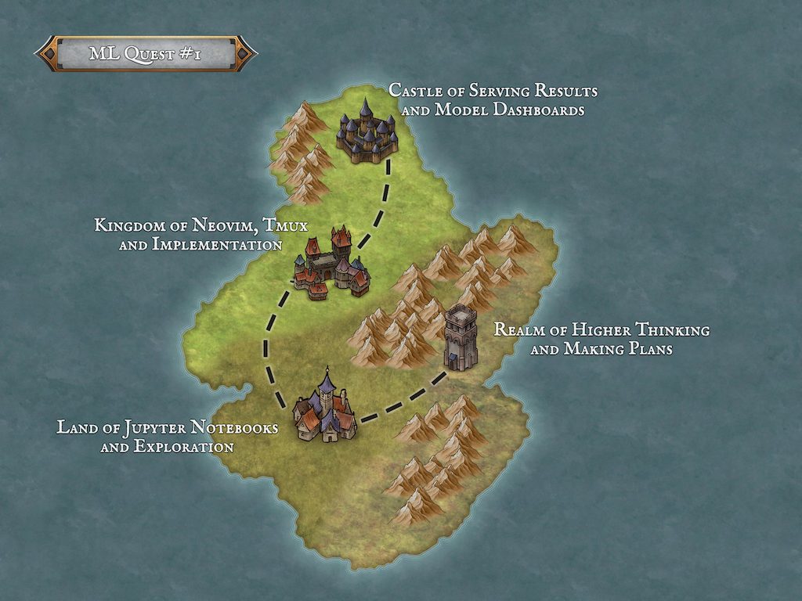

# ML Quest #1: Demand Forecasting
https://www.patreon.com/ZazenCodes



## Notebooks

### Part 1: Data Exploration and Cleaning

Download VS Code or Jupyter Notebook and open `notebooks/1_explore_clean.ipynb` to see setup instructions.


### Part 2: Feature Engineering and Modeling

Same setup as Part 1.

### Part 3: Forecast

Same setup as Part 1.

## Python Model Library

```bash
cd model

# Spin up postgres
docker compose up --build -d meal_demand_postgres

# Train model (replace artifact data)
docker compose run --build meal_demand_app train

# Generate forecast (replace postgres data)
docker compose run --build meal_demand_app predict

# Spin down
docker compose down
```

## Model Serving API

```bash
cd api

# Spin up fastapi and postgres
docker compose up --build

# Fetch demand forecast
curl http://localhost/forecast \
    -X POST -H 'Content-Type: application/json' \
    -d '{"city_name": "Briarwood", "meal_name": "Spiced Apple Tart"}'

# Spin down
docker compose down
```

## User Dashboard

```bash
cd dashboard

# Spin up streamlit and postgres
docker compose up --build

# Open web browser: http://localhost:8501

# Spin down
docker compose down
```

